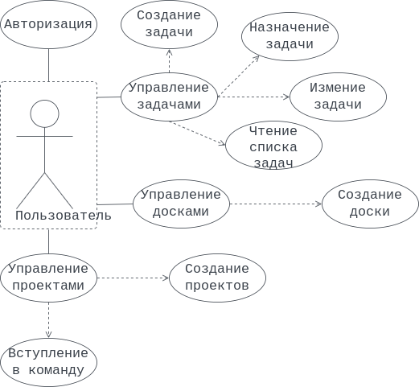
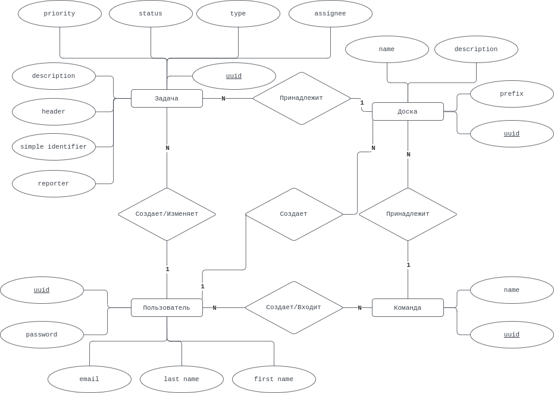
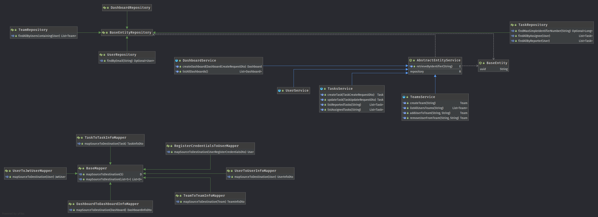

# flowrence
## Краткое описание идеи проекта
flowrence - движок персональной канбан доски для остлеживания занятости. Преимущество канбан доски перед другими обычным списком дел - визуализация, возможность увидеть итоговый результат (сколько сделано за день), провести анализ.  
Пользователь может создавать доски и задачи, добавлять людей в совместные проекты и отслеживать прогресс задач. 

## Краткое описание предметной области
Предметная область включает в себя:  
* Пользователей — людей, которые используют приложение для отслеживания личных задач;
* Команд — групп людей, объединенных общей целью или областью ответственности;
* Задачи — определенные задачи, сообщаемые и назначенные пользователем определенным пользователем.

## Краткий анализ аналогичных решений
| Критерий\проект | flowrence | Jira | Trello | Redmine | Backlog |
| ---------------- | --------- | ---- | ------ | ------- | ------- |
| Открытый исходный код | Да | Нет | Trello | Да | Нет |
| Интегрируемый клиент | Да | Нет | Нет | Частично | Нет |
| Легковесный | Да | Нет | Да | Частично | Да | 

## Краткое обоснование целесообразности и актуальности проекта 
flowrence "отбрасывает лишнее" из процессов управления задачами, делая его одновременно пригодным для использования как в малых командах разработки, так и в личных и проектных целях.

**Диаграмма вариантов использования** 

**ER-диаграмма** 

## Архитектурные характеристики, важные для проекта
1. Ядро:
    1. **Java** 11 или выше
    2. **Spring Boot** _(Web, Security)_, 2.6.6
    3. **Hibernate & JPA** _(w/ Spring Data)_
    5. Прочее: 
        1. Mapstruct
        2. MySQL-коннектор & Postgres-коннектор или любой другой коннектор
        3. Lombok
        4. JUnit (Jupiter)
        5. Logback
2. Сборщик
    1. **Gradle**
3. Базы данных
    1. **MySQL**
    2. **PostgreSQL**
    3. **Oracle**  
    итд.
4. API
    1. **Postman collection** для тестирования API

<!-- ## UML

[Service-Repository layers UML](./meta/diagrams/uml/Service-Repository.uml)

**RDBMS Entities and DTOs**

[RDBMS Entities and DTOs UML](./meta/diagrams/uml/Entity-Dto.uml) -->